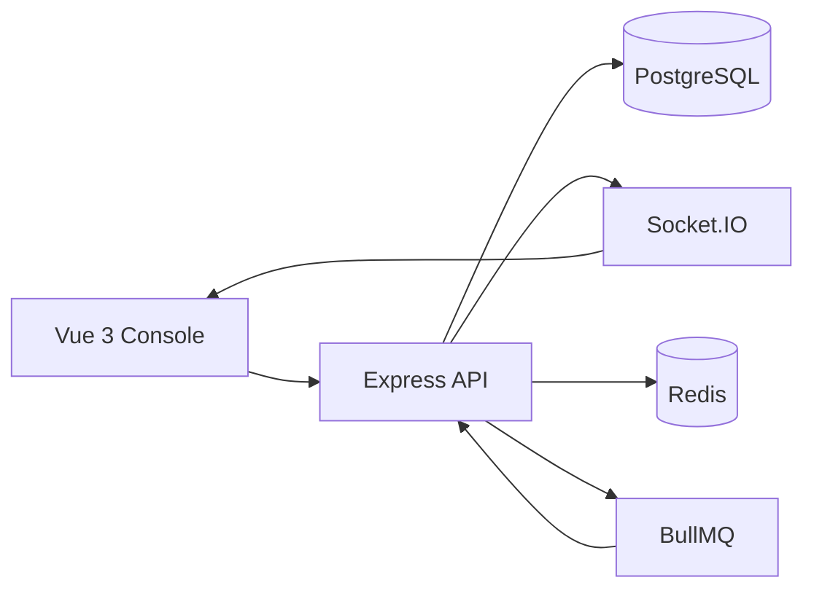
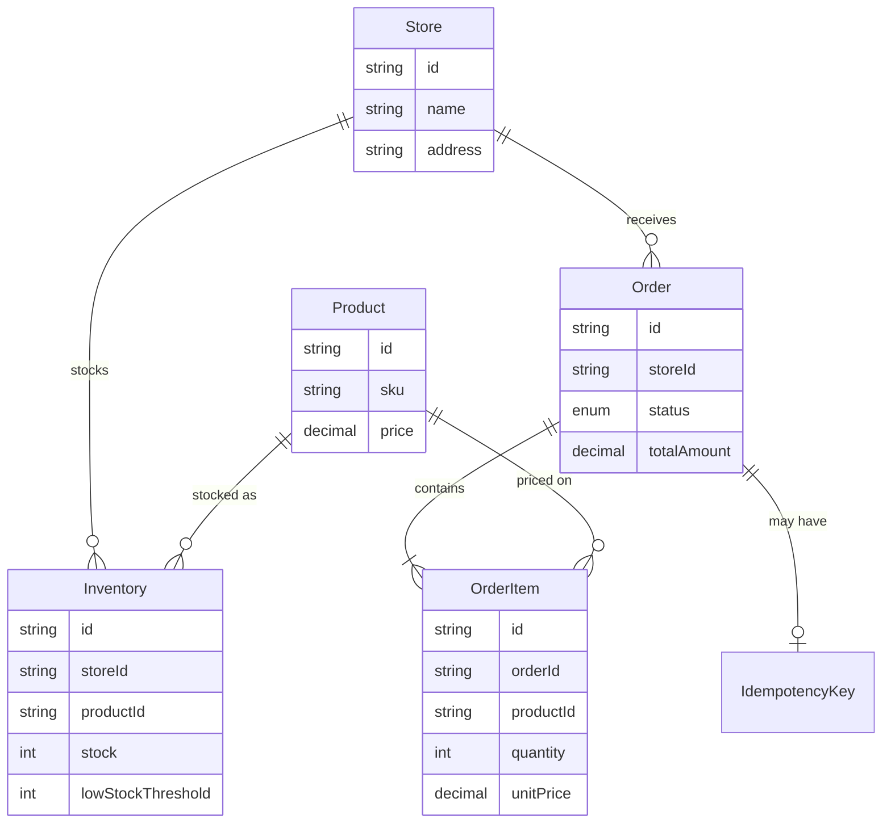
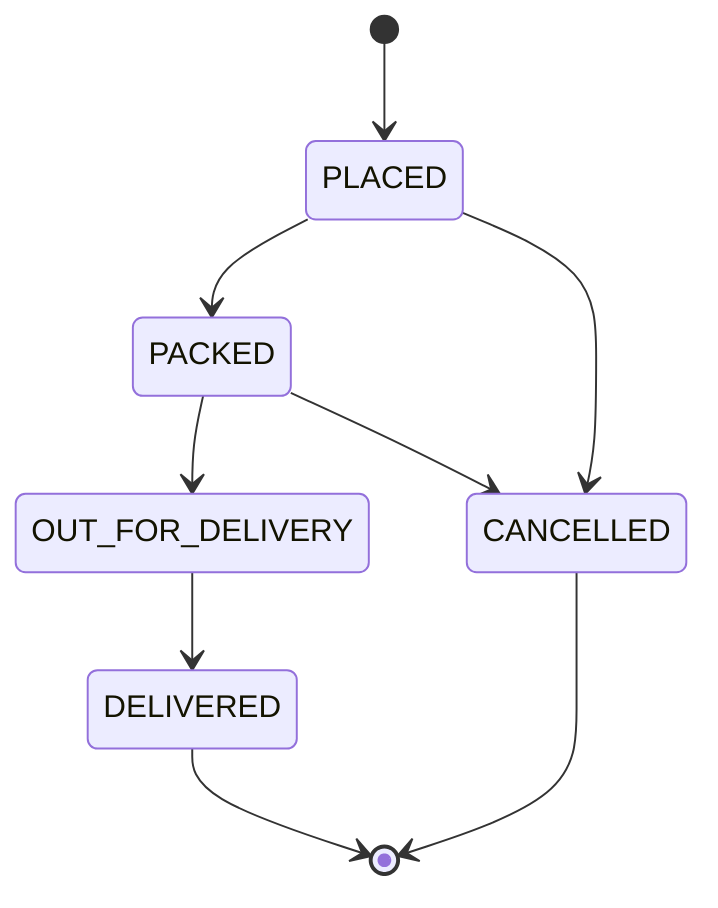

# Gigabox Ops Lite

A small operations console for category stores that promise 60-minute delivery. Staff can watch live orders, move them through packing and delivery, cancel an order before it leaves the store, and adjust per-store stock. The part that matters most is that two customers cannot buy the last unit at the same time.

## Overview

Each store has its own inventory. Placing an order decrements that store's stock inside one database transaction. The order then moves through a fixed lifecycle. Cancelling an order puts the units back, in the same transaction as the status change. Open browsers hear the change over a WebSocket and update immediately. The REST API remains the source of truth.

## Tech Stack

Backend:

- Node.js
- TypeScript
- Express
- PostgreSQL
- Prisma
- Zod
- Socket.IO
- Vitest

Frontend:

- Vue 3
- TypeScript
- Pinia
- Vue Router

Optional, enabled when `REDIS_URL` is set:

- Redis
- BullMQ

Docker Compose can start Postgres, Redis, the API, and the console together.

## Architecture



The Vue console talks only to the REST API and the socket. Controllers validate input and call services. Services own the business rules and the Prisma queries. There is no separate repository layer, because the Prisma calls are already the data access and wrapping them again would not clarify anything.

WebSocket events are published after a transaction commits. If a socket delivery fails, the database change still stands. A reconnecting client refetches the current page.

Redis is optional. Without it, orders and products still work. With it, the product catalog is cached and a delayed job cancels orders that are still `PLACED` after a timeout.

## Database Design



Inventory is separate from Product because a product is the catalog record (SKU, name, price) and stock is a fact about one store. The same milk SKU can be plentiful in Central and gone in Riverside. The unique key is `(storeId, productId)`.

`OrderItem.unitPrice` copies the product price at purchase time. Later price edits must not rewrite historical orders.

Useful indexes for the orders list:

- `(storeId, status, createdAt)` for the usual console filter plus newest-first sort
- `(status, createdAt)` when the store filter is absent
- `(createdAt)` for an unfiltered date range

PostgreSQL can use the leftmost columns of a compound index, so the first index also helps store-only queries.

`Inventory.stock` and `OrderItem.quantity` also have check constraints, so a bug cannot persist a negative stock row even if application code regresses.

## Concurrency Strategy

The unsafe approach is:

1. Read `stock`
2. Check `stock >= quantity` in Node
3. Write `stock - quantity`

Two requests can both read `1`, both pass the check, and both write `0`. One of them should have failed. Under unlucky timing the second write can also store `-1`.

Order creation does not do that. Inside one Prisma transaction it runs, for every item:

```sql
UPDATE "Inventory"
SET stock = stock - requestedQuantity
WHERE "storeId" = $store AND "productId" = $product AND stock >= requestedQuantity;
```

Prisma expresses that as `updateMany` with `stock: { gte: quantity }` and `stock: { decrement: quantity }`. PostgreSQL locks the matching row for the update. The other transaction waits, then re-evaluates the `WHERE` clause against the committed stock. If the first order took the last unit, the second update changes zero rows. The service throws `INSUFFICIENT_STOCK` and the transaction rolls back, so the order row is never inserted and no earlier item in the same order stays decremented.

Read Committed is enough here. The condition lives in the same statement as the write, so we do not need `SERIALIZABLE` or `SELECT ... FOR UPDATE`.

Race example: stock is 1. Request A and Request B both ask for quantity 1.

- A's update matches `stock >= 1` and sets stock to 0.
- B's update matches zero rows.
- A commits an order. B rolls back.
- Final stock is 0. It is never -1.

The same conditional update is used for negative stock adjustments. Cancellation uses `updateMany` on the order status (`WHERE status = 'PLACED'`, for example) so two cancel requests cannot both restore stock.

Duplicate product ids in one request are summed first, so the same row is decremented once.

An optional `Idempotency-Key` header stores a hash of the normalized request in the same transaction. A retry returns the original order. A reused key with a different body returns `IDEMPOTENCY_KEY_MISMATCH`. If two identical retries race, the unique key lets one commit and rolls the other back.

## Order State Machine



Allowed transitions live in `backend/src/domain/orderState.ts`. Controllers do not re-implement them.

`DELIVERED` and `CANCELLED` are terminal. An order that is `OUT_FOR_DELIVERY` cannot be cancelled: the goods have left the store, and restoring shelf stock would be wrong. Anything else illegal returns HTTP 409 `INVALID_ORDER_TRANSITION`.

Cancellation loads the order, checks the transition, sets `CANCELLED` only if the status is still the one we read, then increments inventory for every line. Those writes commit or roll back together.

## REST API

Errors share one shape:

```json
{
  "success": false,
  "error": {
    "code": "INSUFFICIENT_STOCK",
    "message": "Insufficient stock for product",
    "details": { "productId": "..." }
  }
}
```

Codes include `VALIDATION_ERROR`, `NOT_FOUND`, `INSUFFICIENT_STOCK`, `INVALID_ORDER_TRANSITION`, `STOCK_CANNOT_BE_NEGATIVE`, `PRODUCT_IN_USE`, `RATE_LIMIT_EXCEEDED`, `IDEMPOTENCY_KEY_MISMATCH`, and `INTERNAL_SERVER_ERROR`. Production responses do not include stack traces or raw database errors.

| Method | Path | Purpose |
| --- | --- | --- |
| GET | `/api/health` | Liveness |
| GET | `/api/stores` | Stores for the console filters |
| GET, POST | `/api/products` | List and create products |
| GET, PATCH, DELETE | `/api/products/:id` | Read, update, delete. Delete is rejected when an order references the product |
| GET, POST | `/api/stores/:storeId/inventory` | List or add a store stock row |
| PATCH | `/api/stores/:storeId/inventory/:productId` | Set stock or the low-stock threshold. Stock cannot be negative |
| PATCH | `/api/stores/:storeId/inventory/:productId/adjust` | Signed adjustment. Negative changes are conditional updates |
| POST | `/api/orders` | Create an order. Rate limited, default 20 requests per minute per IP. Optional `Idempotency-Key` header |
| GET | `/api/orders` | Paginated list. `page`, `limit` (max 100), `status`, `storeId`, `from`, `to`, `sortBy`, `sortOrder` |
| GET | `/api/orders/:id` | One order |
| PATCH | `/api/orders/:id/status` | `{ "status": "PACKED" }` |

`GET /api/orders` filters and pages in PostgreSQL (`findMany` + `count` together). Sort fields are a whitelist: `createdAt`, `updatedAt`, `totalAmount`, `status`. Date-only `from` / `to` values are interpreted as UTC day bounds.

Prices are calculated on the server from `Product.price`. The client cannot send a price. Money is stored as `Decimal` and returned as a two-decimal string.

## Real-Time Updates

Socket.IO emits:

- `order:created` with the created order
- `order:statusChanged` with `{ orderId, storeId, previousStatus, status, updatedAt }`
- `inventory:updated` with the new stock for one store and product

The console patches Pinia state from those events. If the order is already on screen, the status event updates that row instead of inserting a duplicate. A status filter drops an order that no longer matches. On connect, including reconnect, the open screen refetches so a missed event does not linger.

One Node process broadcasts to its own sockets. More than one API instance needs the Socket.IO Redis adapter, or another pub/sub fan-out, so an event published on instance A reaches browsers connected to instance B. The publisher is a single function (`setRealtimePublisher`) so that adapter can be attached without rewriting the services.

## Setup

Local Postgres from Docker, API and console on the host:

```bash
cp .env.example backend/.env
docker compose up -d postgres
npm install
npm run db:migrate
npm run db:seed
npm run dev
```

In a second terminal:

```bash
npm run dev:web
```

Open `http://localhost:5173`.

From `backend/` the same database commands are `npx prisma migrate dev` (or `npm run db:migrate`, which runs `prisma migrate deploy`) and `npm run db:seed`.

Full stack, including Redis, auto-cancel, and the built console:

```bash
docker compose up --build
```

The console is at `http://localhost:8080`. The API is at `http://localhost:3000`. The backend container applies migrations and seeds when the database is empty. A later restart does not wipe orders.

These database credentials exist only for local development.

## Seed Data

`npm run db:seed` creates:

- 2 stores: Gigabox Central and Gigabox Riverside
- 50 products
- inventory for both stores
- 200 orders across `PLACED`, `PACKED`, `OUT_FOR_DELIVERY`, `DELIVERED`, and `CANCELLED`

Open orders (`PLACED`, `PACKED`, `OUT_FOR_DELIVERY`) decrement current stock with the same conditional update the API uses. Delivered orders are historical and do not reduce today's stock, because replenishment is not modeled. Cancelled orders do not reduce stock. The first six SKUs in each store start low, including one at zero, and are not used by open orders, so the inventory screen has visible low-stock rows.

Running the seed again skips when stores already exist. `npm run db:seed:fresh` in `backend/` wipes and recreates the data.

## Testing

```bash
npm test
```

That runs from the repo root and uses the `gigabox_test` database created beside the dev database. Tests hit real PostgreSQL. They do not mock the stock update.

Covered behavior:

- creating an order decrements stock and snapshots price
- a short item rolls back the whole order
- duplicate lines in one order are merged
- two concurrent buyers of the last unit: one success, one `INSUFFICIENT_STOCK`, stock ends at 0
- ten concurrent buyers against stock 5: five succeed
- legal and illegal lifecycle moves
- cancellation restores stock once, including a concurrent double cancel
- the auto-cancel handler cancels only orders still in `PLACED`
- negative stock adjustments are rejected
- HTTP validation, pagination, and 409 transitions

## Assumptions

- An order cannot be cancelled once it is `OUT_FOR_DELIVERY`.
- `OrderItem.unitPrice` is a snapshot. The client never supplies price.
- Inventory is per store, not global.
- API timestamps are UTC.
- Products referenced by orders cannot be hard-deleted (`PRODUCT_IN_USE`).
- There is no authentication. This is a single-operator console.
- Absolute stock edits (`PATCH` with `stock`) are last-write-wins. The adjustment endpoint is the concurrency-safe path.
- The seed's delivered orders are a snapshot of history, not a full goods-receipt ledger.
- `AUTO_CANCEL_MINUTES` defaults to 5. The job is scheduled only when Redis is configured.

## Tradeoffs

This is a weekend-sized system, so a few things were kept direct on purpose.

- Express route, controller, and service files instead of a framework with modules, guards, and a generic repository.
- Offset pagination (`skip` / `take`) with a hard limit of 100. It is easy to explain and matches the required response. Deep pages get slower; cursor pagination would be the next step.
- Socket.IO broadcasts to every connected console. Room-per-store would matter with many stores, not with two.
- Product list caching only. Inventory and orders are not cached, because a stale stock number would undermine the concurrency work. The catalog cache has a 60 second TTL and is deleted when a product is created, updated, or deleted.
- Auto-cancel failure to enqueue does not fail order creation. The order is already committed. The missed job is logged.
- Idempotency keys are optional. Clients that do not send one behave exactly as a normal create.

## With More Time

- Authentication and role-based access for store staff versus central ops
- An audit log of who changed status and stock
- Structured logging, metrics, and tracing
- Cursor pagination
- Socket.IO Redis adapter for multiple API instances
- Browser end-to-end tests
- Required idempotency keys on create
- A reservation hold that expires independently of the full cancel job
- OpenAPI documentation
- CI that runs the PostgreSQL integration tests

## How this could run as more than one instance

PostgreSQL already coordinates stock: conditional updates lock rows across all API instances. Rate limiting and Socket.IO do not. Per-IP limits would move to a shared store such as Redis. Socket events would go through the Socket.IO Redis adapter. The BullMQ worker should run as one consumer group so two workers do not both need custom locking; the status `updateMany` still makes a duplicate cancel safe if it happens.

## AI Usage

I used Cursor as a development assistant for scaffolding, reviewing code, generating test cases, debugging TypeScript issues, and discussing architecture. All architectural decisions and generated code were reviewed and understood before inclusion.
